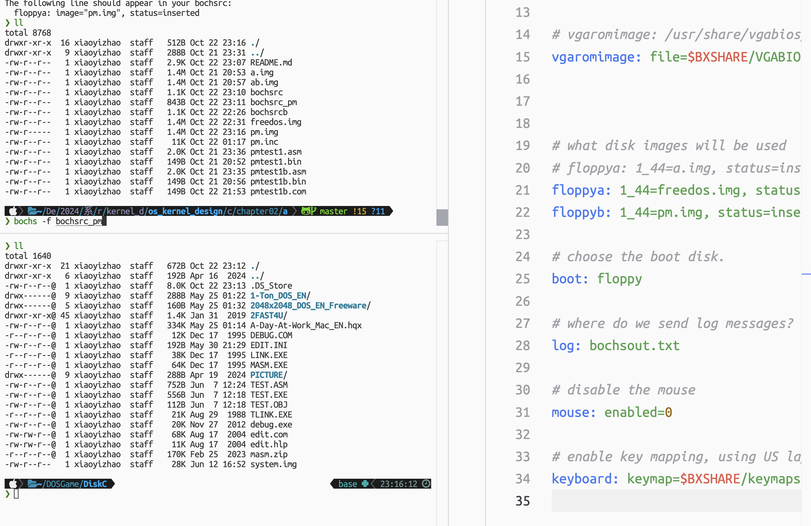
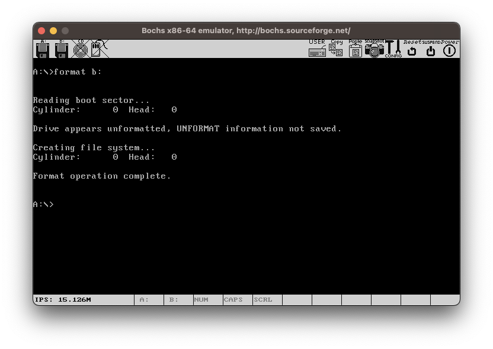
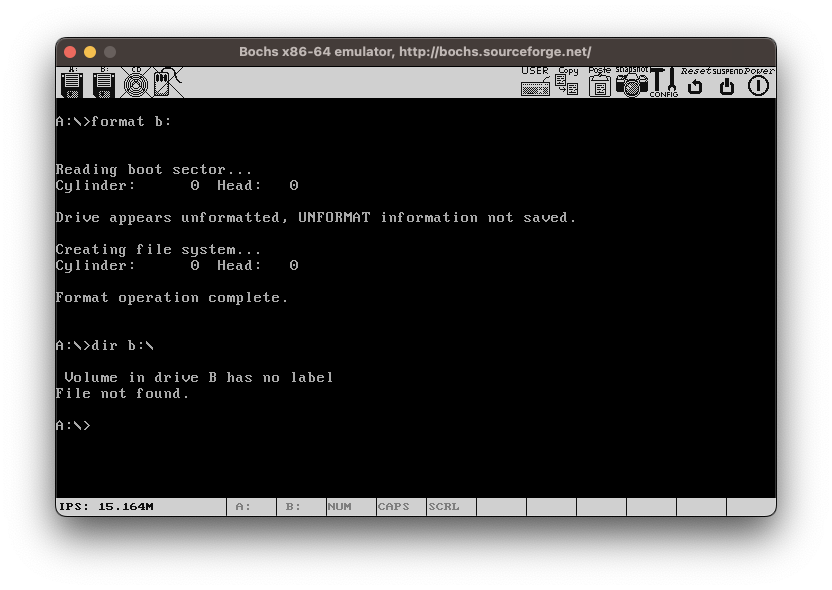
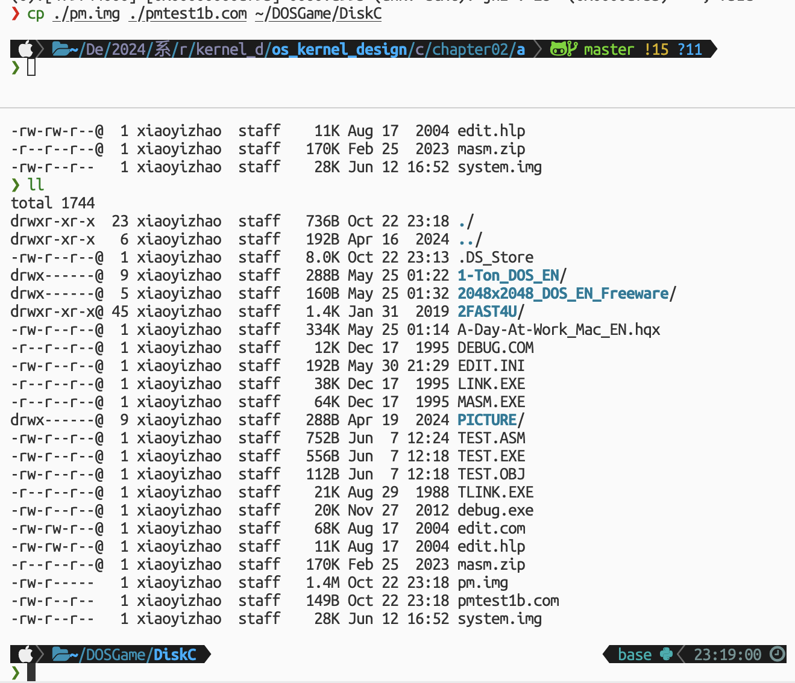
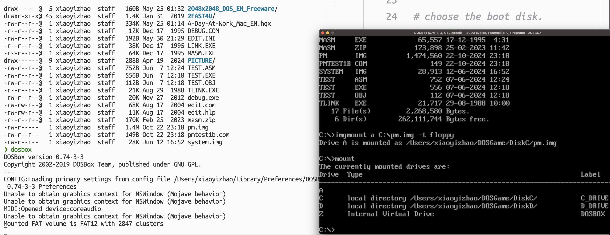
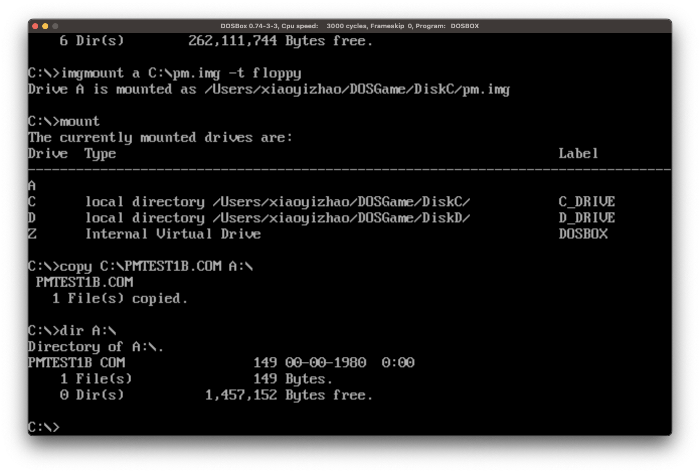
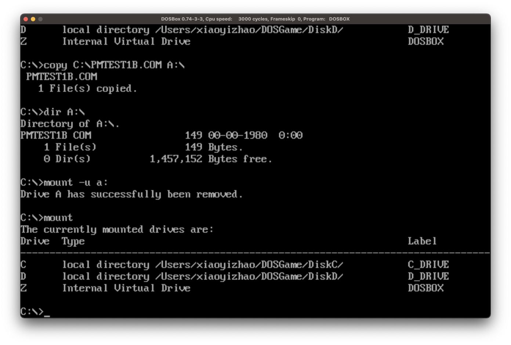
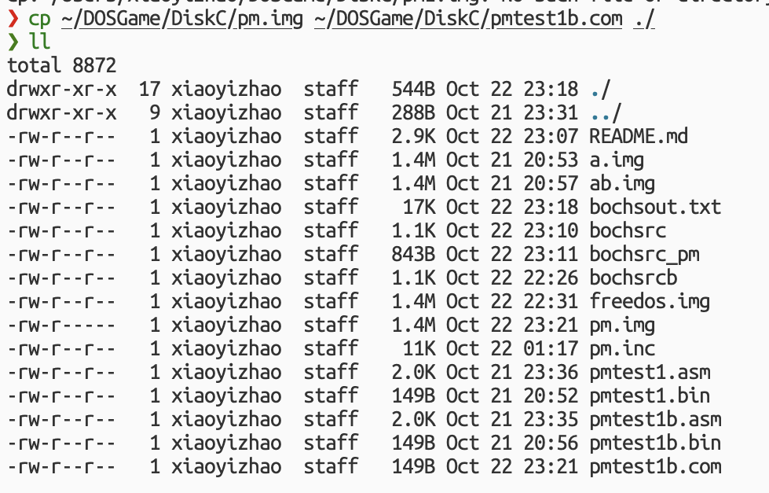
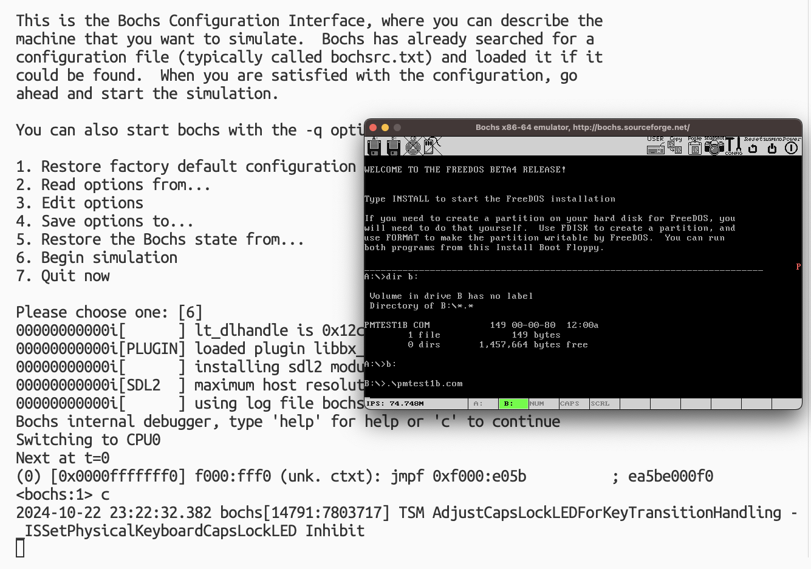

### chapter02_a

实验指导书中出现过这样一步：

> 6. 将pmtest1.com复制到虚拟软盘pm.img上
> ▹ sudo mount -o loop pm.img /mnt/floppy
> ▹ sudo cp pmtest1.com /mnt/floppy/
> ▹ sudo umount /mnt/floppy

这里作者下面给了个提示：

> 上述步骤在Linux和Windows下没有太大区别，
> 唯一例外的是第6步，如果你用Windows的话这一步骤需要在虚拟的Linux中完成。

但其实也可以不用虚拟 Linux（尽管我用的是mac），我们还有 DOSBox 呢～

会想到 DOSBox 是因为：

在经历探索之后发现，如果我们要在 FreeDOS 上将软盘挂载上去并支持 FreeDOS 的操作，那么这个软盘的文件系统也应该相同。

这里的第 6 步目的其实是要将 `pm.img` 挂载到本机系统上，这样支持本机文件系统的操作，从而能把我们的程序复制到软盘内部。

而 macOS 我看支持的文件系统中没有 FAT12，至少我用的工具（比如 hdiutil、fdisk）都没办法将 `pm.img` 挂载上去。

这时我想到是不是既然 DOSBox 运行的是 DOS，还能跑各种古老的程序，是否就支持这种文件系统呢？

于是进行了以下操作：

1. 准备材料

我首先用 bochs 运行 FreeDOS，这里将 `freedos.img` 作为启动盘，`pm.img` 作为 B 盘。



将 `pm.img` 格式化：

```dos
FORMAT B:
```




这样，`pm.img` 就成了带有 FreeDOS 支持的文件系统的空白软盘。

随后我将要装入的程序（改动后的，就是 `pmtest1b.com`） 以及 `pm.img` 放到 DOSBox 映射的虚拟 C 盘下，这样我们在 DOSBox 中的 C 盘下能轻易找到我们的材料。



2. 复制程序

将我们改动过的 `pmtest1.com`（这里就是 `pmtest1b.com` ）复制到虚拟软盘 pm.img 上。
   
i. 在 DOSBox 中挂载 `pm.img`，指定为 A 盘（或 B 盘）；

这里用 A 盘举例：

```dos
IMGMOUNT A C:\path\to\pm.img -t FLOPPY
```



这里标记一个网站 [DOSBoxWiki](https://www.dosbox.com/wiki/IMGMOUNT)，

`IMGMOUNT` 命令格式：

```dos
IMGMOUNT DRIVE [imagefile] -t [image_type] -fs [image_format]
-size [sectorsbytesize, sectorsperhead, heads, cylinders -u DRIVE]
```

ii. 将 `pmtest1b.com` 复制到 A 盘（或 B 盘）；

这里用 A 盘举例：

```dos
COPY C:\path\to\pmtest1b.com A:\
```



这样我们就得到了我们想要的软盘。为了完整想卸载就使用这个命令：

```dos
MOUNT -u [Drive-Letter]
```



其实也可以不用卸载，退出就完了。

3. 最后把我们得到的 `pm.img` 移动到我们想要的目录就行了～



虽然总体过程稍微烦琐了点，但我们也不会因为这个问题而困扰了呀，这波是不是不亏啊～

在此之前还想着是不是还可以通过直接的二进制编辑达到目的…… 

但是我对这个文件系统的结构不太了解，010 Editor 的解析模版里也没找到对应的（可能有但是我忽略了）。

虽然找到了一点点规律，但也仅此而已了，没有尝试把二进制数据复制进去。

就算可以，手动找地址也不如这样来得快吧（

这是成功运行的截图：


